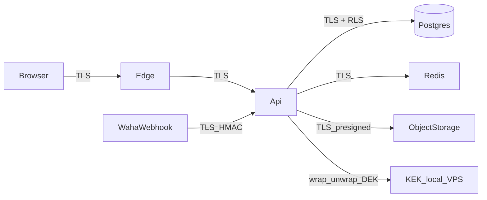

# 17 — Baseline de Segurança Enterprise

Documento operacional de segurança do MVP. Complementa (não substitui) o [10 — Segurança, LGPD e Compliance](./10-seguranca-lgpd-compliance.md). Decisão de criptografia: [ADR-0007](./adr/0007-criptografia-envelope-tenant.md). Requisitos: [RNF-SEC](./requisitos/nao-funcionais/requisitos-nao-funcionais.md) e [checklist OWASP](./requisitos/nao-funcionais/RNF-seguranca-owasp.md).

> **Modelo adotado:** enterprise (TLS + criptografia em repouso + envelope encryption por tenant). **Não** é E2EE no cliente — o servidor descriptografa em memória no request autorizado. Ver ADR-0007. Molde **idêntico** ao prontuário odontológico de referência; campos cifrados são os do domínio da barbearia.

---

## 1. Princípios

1. **Defesa em profundidade:** UI ≪ RBAC ≪ RLS ≪ criptografia ≪ auditoria ≪ anomalias.
2. **Falha fechada:** sem contexto de tenant → zero linhas; sem permissão → 403; recurso alheio (outro tenant **ou** outra unidade fora do escopo) → 404.
3. **Minimização:** não coletar, não logar, não enviar (WhatsApp) PII desnecessária.
4. **Confiança zero na borda:** todo input validado (Zod); toda autorização no servidor; `tenant_id` nunca do body.
5. **Segredos nunca no código** nem em log; apenas gerenciador de segredos / arquivo na VPS.
6. **Auditabilidade:** ação sensível deixa rastro append-only correlacionável por `requestId`.
7. **Não prometer o que não temos:** WAHA não é canal oficial da Meta; billing SaaS é manual no MVP.

---

## 2. Modelo de ameaças (STRIDE resumido)

| Ameaça | Exemplos no produto | Controles principais |
| --- | --- | --- |
| **S**poofing | Roubo de sessão, impersonação de webhook WAHA | JWT curto + refresh rotativo; HMAC webhook; MFA `platform_admin` |
| **T**ampering | Manipular pagamento, trocar `tenant_id`, overbooking | RLS WITH CHECK; EXCLUDE gist; idempotência; envelope |
| **R**epudiation | Negar envio de mensagem ou alteração de papel | `audit_log` append-only |
| **I**nformation disclosure | Vazamento entre tenants, entre unidades, log com telefone | RLS; `user_locations`; 404; redaction; envelope; CSP |
| **D**enial of service | Flood em login/página pública/webhook | Rate limit por IP/tenant/rota; body limit; filas |
| **E**levation of privilege | STAFF lendo agenda alheia; suporte sem break-glass | RBAC; deny-by-default; impersonation somente leitura |

Atores considerados: recepcionista maliciosa, barbeiro curiosidade excessiva, gerente de outra unidade, atacante externo, insider da plataforma, tenant vizinho, provedor comprometido.

---

## 3. Arquitetura de criptografia



### 3.1 Camadas

| Camada | Mecanismo | Escopo |
| --- | --- | --- |
| Trânsito externo | TLS 1.2+ (preferir 1.3), HSTS, redirect HTTP→HTTPS | Browser ↔ CDN/Edge ↔ API; webhooks |
| Trânsito interno | TLS para Postgres, Redis, S3 | API/worker ↔ infra |
| Repouso (infra) | Volume encryption + backups cifrados; SSE no object storage | Disco e anexos |
| Repouso (aplicação) | Envelope AES-256-GCM por tenant (DEK); **KEK local na VPS** (MVP); Vault self-hosted depois | Campos definidos abaixo — [ADR-0013](./adr/0013-kms-local-vps.md) |
| Segredos | Env/arquivo na VPS (MVP); Vault depois; `access_token_ref` para WhatsApp | Tokens, JWT keys, DB URLs, KEK |

### 3.2 Envelope encryption por tenant

```
provisionamento do tenant
  → gera DEK (32 bytes)
  → Wrap(DEK, KEK_local) via KeyManagementPort → armazena wrapped_dek em tenant_crypto_key
  → DEK em plaintext só em memória / cache curto com TTL

leitura/escrita de campo cifrado
  → Unwrap DEK via KeyManagementPort (ou cache)
  → AES-256-GCM encrypt/decrypt com AAD = tenantId|table|column|rowId
  → persiste coluna text = Base64( version(1) || nonce(12) || ciphertext || tag(16) )
```

#### Formato de ciphertext (MVP)

DDL de `tenant_crypto_key` entra no [doc 07](./07-modelo-de-dados.md) na reescrita da Parte 2. Até lá, este é o contrato:

```
bytes = version(1) || nonce(12) || ciphertext(N) || tag(16)
coluna = Base64(bytes)
```

| Parte | Tamanho | Função |
| --- | --- | --- |
| `version` | 1 byte | `0x01` = v1 |
| `nonce` | 12 bytes | aleatório único por encrypt (GCM) |
| `ciphertext` | N bytes | texto original cifrado (AES-256-GCM) |
| `tag` | 16 bytes | autenticação GCM |

**AAD:** `` `${tenantId}|${table}|${column}|${rowId}` ``

Regras:

1. Decrypt **somente** após `TenantPrisma.runInTenantContext` + `authorize(...)`.
2. DEK nunca vai para log, Sentry, analytics ou resposta de erro.
3. Rotação de KEK: rewrap de todas as DEK (sem re-cifrar payloads).
4. Rotação de DEK (fase 2): re-cifrar campos em job assíncrono por tenant.
5. Port `KeyManagementPort` isola o provedor — **MVP: adapter local na VPS**; intenção futura: Vault self-hosted.
6. Não usar `jsonb` para o envelope.

#### Como funciona (linguagem simples)

Imagine um **cofre dentro de um cofre**:

1. A **nota** (cliente ou agendamento) é o “papel” que queremos esconder.
2. A **DEK** (chave da barbearia) é a chave do cofre pequeno: cada tenant tem a sua.
3. A **KEK** (chave mestra na VPS) tranca a DEK. No banco **não** fica a chave da barbearia aberta — só a DEK já trancada.
4. Quem abrir o dump do banco sem a KEK vê só ciphertext.
5. Quando um usuário autorizado abre a ficha: a API prova identidade → contexto do tenant (RLS) → destranca a DEK → devolve o texto **só na memória daquele request**.
6. O **AAD** amarra o pacote à barbearia e à linha certa: copiar ciphertext para outro registro **falha**.

Isso **não** é E2EE. O servidor ainda vê o texto quando um usuário autorizado pede — necessário para busca, WhatsApp, exportação e suporte controlado.

### 3.3 O que cifrar no MVP (envelope)

| Cifrar (ciphertext) | Manter plaintext (+ RLS) | Motivo |
| --- | --- | --- |
| `customer.notes` | — | Texto livre; pode conter PII extra |
| `appointment.notes` | — | Texto livre operacional |
| — | `customer.name`, `phone` | Busca operacional e unicidade E.164 |
| — | Agenda (horários, status, IDs) | Operação do barbeiro |
| — | Valores financeiros (`*_cents`) | Relatórios e aritmética |
| — | Status, enums, FKs, timestamps | Índices e máquinas de estado |
| Anexos (logo/foto) | Object storage privado + URL pré-assinada | SSE do provedor no MVP |

### 3.4 O que NÃO é E2EE

- A plataforma (operador LGPD) processa plaintext em memória para cumprir o contrato com a barbearia.
- WhatsApp, busca, relatórios e exportação exigem dados legíveis no servidor.
- Break-glass auditado continua possível (somente leitura no MVP).

---

## 4. Gestão de chaves e segredos

| Item | Política (MVP) | Futuro |
| --- | --- | --- |
| KEK | Arquivo/env na VPS; permissão restrita; nunca no Git ([ADR-0013](./adr/0013-kms-local-vps.md)) | Vault (ou equivalente) self-hosted |
| DEK | Uma ativa por tenant; wrapped no banco; plaintext só em memória | Idem |
| JWT | Par RS256 com `kid`; rotação com duas chaves ativas | Idem / Vault |
| WhatsApp | Token por referência (`access_token_ref`); `WAHA_API_KEY` só no backend | Idem |
| `.env` local | Nunca commitado; gitleaks no CI | Segredos no Vault |
| Acesso VPS | SSH por chave; MFA no painel Hostinger quando disponível | Idem |
| Dev/staging | KEK distinta da produção; **zero** dado real de cliente | Idem |

Implementação alvo: `shared/crypto/` + `LocalKeyManagementAdapter` → depois `VaultKeyManagementAdapter`; uso só em `repositories/` (borda), nunca em `models/`.

---

## 5. Auditoria reforçada

### 5.1 Propriedades

- Tabela `audit_log` **append-only** (trigger bloqueia UPDATE/DELETE).
- Particionamento mensal; 12 meses quente + 5 anos arquivo frio.
- Correlação: `requestId`, `tenantId`, `locationId`, `actorId`, `customerId` (quando aplicável).
- Owner consulta via API; suporte só via break-glass.

### 5.2 Eventos obrigatórios (além do doc 10)

| Categoria | Eventos |
| --- | --- |
| Auth | `LOGIN`, `LOGIN_FAILED`, `LOGOUT`, `PASSWORD_RESET`, `REFRESH_REUSE_DETECTED`, `SESSION_REVOKED` |
| Admin | `ROLE_CHANGED`, `MEMBER_INVITED`, `MEMBER_DEACTIVATED`, `PERMISSION_DENIED`, `LOCATION_SCOPE_DENIED` |
| Dados | `EXPORT_REQUESTED`, `EXPORT_COMPLETED`, `DSR_*`, `TENANT_ANONYMIZED`, `CUSTOMER_ANONYMIZED` |
| Mensagens | `MESSAGE_SENT`, `MESSAGE_FAILED`, `WAHA_SESSION_DISCONNECTED` |
| Billing | `SUBSCRIPTION_STATUS_CHANGED`, `GRACE_EXTENDED` |
| Plataforma | `SUPPORT_ACCESS_GRANTED`, `SUPPORT_ACCESS_USED`, `CRYPTO_DEK_ROTATED`, `ANOMALY_TRIGGERED` |
| Segurança | `CROSS_TENANT_DENY`, `CROSS_LOCATION_DENY`, `RATE_LIMITED` (amostrado) |

### 5.3 O que nunca vai no audit payload

Notas de cliente/agendamento, corpo de mensagem WhatsApp, senha, tokens, DEK, telefone completo (usar últimos 4 ou hash truncado se necessário para investigação).

---

## 6. Detecção de anomalias (MVP — regras, não ML)

Job periódico + contadores em Redis; alerta para canal interno e, quando afetar a barbearia, notificação ao Owner.

| Regra | Sinal | Ação |
| --- | --- | --- |
| `anomaly.login_bruteforce` | Falhas de login por IP/e-mail acima do limiar | Bloqueio já existente + alerta |
| `anomaly.refresh_reuse` | Reuso de refresh | Revogar família + alerta S1 ao usuário |
| `anomaly.mass_export` | > 1 exportação completa / hora | Alerta; throttle opcional |
| `anomaly.cross_tenant` | Rajada de 404 em recursos por ID | Rate limit endurecido + alerta |
| `anomaly.cross_location` | Rajada de 404 entre unidades do mesmo tenant | Alerta S2 |
| `anomaly.support_access` | Qualquer break-glass | Sempre notifica Owner |
| `anomaly.role_escalation` | Mudança para OWNER | Alerta + audit |
| `anomaly.waha_down` | Sessão desconectada | Alerta operacional + UI |

Falsos positivos são aceitáveis no MVP; tuning após piloto. Sem bloqueio automático destrutivo (exceto auth já definido). **Nada suspende tenant por inadimplência automaticamente** — só operação humana + `grace_until`.

---

## 7. Segurança entre endpoints

| Hop | Controle |
| --- | --- |
| Browser → API | TLS, CORS allowlist por ambiente, CSP, `helmet`, cookies `Secure` |
| API → Postgres | TLS + role `app_user` sem BYPASSRLS; migrações com `app_migrator` |
| API → Redis | TLS (prod); filas com payload mínimo (IDs) |
| API → Object storage | TLS; bucket privado; URL pré-assinada curta; upload não passa pela API |
| API → KEK local | Arquivo/env na VPS; nunca no Git |
| WAHA → API | TLS + HMAC; resposta 200 rápida; processamento em fila |
| API ↔ Worker | Mesmo artefato; confiança via rede privada; **mTLS opcional na fase 2** |
| Frontend → APIs de terceiros | Proibido chamar WAHA/S3/DB; só nossa API |

Headers mínimos na API (via `helmet` + config):

- `Strict-Transport-Security`
- `Content-Security-Policy`
- `X-Content-Type-Options: nosniff`
- `Referrer-Policy: no-referrer` (ou `strict-origin-when-cross-origin`)
- `Permissions-Policy` restritiva
- `Cache-Control: no-store` em respostas autenticadas com dado sensível

---

## 8. OWASP Top 10 (2021) → controles do stack

| # | Risco | Controle no projeto |
| --- | --- | --- |
| A01 Broken Access Control | RBAC + `user_locations`; RLS; 404 cross-tenant e cross-unidade; testes no CI |
| A02 Cryptographic Failures | TLS; Argon2id; envelope AES-GCM; sem segredo em repo; KEK na VPS |
| A03 Injection | Prisma parametrizado; `$queryRaw` só com placeholders; Zod na borda |
| A04 Insecure Design | Threat model por épico; EXCLUDE anti-overbooking; outbox; deny-by-default |
| A05 Security Misconfiguration | `helmet`, CORS, env validado (Zod), sem stack em prod, headers |
| A06 Vulnerable Components | `pnpm audit`, Dependabot/Renovação, lockfile, CI falha em high+ |
| A07 Identification & Auth Failures | JWT curto, refresh rotativo, lockout, reset seguro, rate limit auth |
| A08 Software/Data Integrity | OpenAPI diff; lockfile; signed webhooks; snapshot de preços |
| A09 Security Logging & Monitoring | audit_log; Pino; anomalias; alertas S1/S2; Sentry com scrubbing |
| A10 SSRF | Sem fetch de URL de usuário; allowlist de webhooks; storage só por key interna |

Checklist detalhado com IDs: [RNF-seguranca-owasp.md](./requisitos/nao-funcionais/RNF-seguranca-owasp.md).

---

## 9. OWASP API Security Top 10 → middlewares

Ordem canônica (ver [08 — API v1](./08-api-v1.md)):

`helmet` → `cors` → `requestId` → `bodyLimit` → `rateLimit` → `authenticate` → `tenantContext` → `authorize` → `subscriptionGuard` → `validate(schema)` → `auditRead?` → handler → `errorHandler`

| API Risk | Controle |
| --- | --- |
| API1 BOLA / Object-level | RLS + `user_locations`; nunca confiar em `tenantId` do body |
| API2 Broken Auth | Fluxo identity; refresh reuse detection |
| API3 BOPLA / Property-level | Schemas Zod de response; STAFF sem agenda alheia; máscara na API pública |
| API4 Resource consumption | Rate limit; paginação max 100; export async; body 1 MB |
| API5 BFLA / Function-level | `authorize(permission)` por rota; matriz papel × endpoint × unidade |
| API6 Business flow | Idempotency-Key; máquina de estados; limite de bookings por telefone |
| API7 SSRF | Ver A10 |
| API8 Misconfiguration | Headers, CORS, OpenAPI sem rotas internas públicas |
| API9 Inventory | OpenAPI gerado; rotas `/internal/*` fora do docs público |
| API10 Unsafe consumption | Validar payloads de webhook WAHA/pagamento futuro; timeout |

---

## 10. Secure SDLC

### 10.1 Por feature / PR

Checklist obrigatório (além do DoD de [doc 12](./12-qualidade-testes.md)):

- [ ] Onde entra input? Schema Zod definido?
- [ ] Quem pode acessar? Permissão + teste por papel **e** unidade?
- [ ] Dado de outro tenant? RLS / teste de isolamento?
- [ ] Campo de texto livre novo? Entra no envelope? Audit?
- [ ] O que é logado? Redaction ok?
- [ ] Job/fila: idempotente + `tenantId` + sem PII no payload?
- [ ] Segredo novo? Só no env da VPS / EasyPanel?

### 10.2 CI (segurança)

| Gate | Ferramenta |
| --- | --- |
| Segredos | gitleaks |
| Deps | `pnpm audit --audit-level=high` |
| Fronteiras | dependency-cruiser + eslint boundaries |
| Isolamento | testes RLS + escopo de unidade (Testcontainers) |
| Contrato | OpenAPI diff |
| Baseline dinâmico | OWASP ZAP baseline (staging/preview) |
| Tipos | `tsc --noEmit` strict |

### 10.3 Threat model leve por épico

Antes de fechar o épico: listar 3–5 abusos possíveis e o controle correspondente. Armazenar no PR ou em nota curta no módulo — sem cerimônia pesada.

---

## 11. Matriz MVP × Fase 2+

| Controle | MVP | Fase 2+ |
| --- | --- | --- |
| TLS + HSTS + helmet/CSP | ✔ | ✔ |
| RLS + testes CI | ✔ | ✔ |
| Escopo de unidade + testes CI | ✔ | ✔ |
| Envelope nos campos definidos | ✔ | Expandir campos / anexos CMEK |
| Audit append-only | ✔ | — |
| Anomalias por regra | ✔ | ML / UEBA se escala justificar |
| MFA TOTP | `platform_admin` obrigatório | Obrigatório para OWNER |
| mTLS API↔worker | — | Avaliar |
| WAF ruleset custom | CDN básico | Regras por rota auth/public |
| Pentest externo | — | Antes de escalar base |
| Checkout Stripe/MP/Asaas | **Não** (ADR-0010) | Novo ADR |
| Cloud API WhatsApp | Só por env | Se WABA existir |
| E2EE no cliente | **Não** | Só se produto decidir (ADR novo) |

---

## 12. Fundação na Sprint 0

Incluir na S0 (sem mudar pontos dos épicos de produto):

1. Secrets + validação de `env` (Zod) — app não sobe inválido
2. Middlewares de segurança esqueleto (`helmet`, CORS, rate limit, requestId, errorHandler)
3. Prisma + RLS na primeira tabela + testes de isolamento tenant **e** unidade
4. Port `KeyManagementPort` + implementação stub/local; desenho de `tenant_crypto_key`
5. Esqueleto de `audit_log` + helper `platform.audit.record`
6. CI: lint, typecheck, arch, gitleaks, audit
7. Documentação de runbook mínimo: vazamento de credencial, suspeita de cross-tenant, sessão WAHA caída

Detalhe de implementação de código fica para quando a implementação começar — este doc é a política.

---

## Referências

- [10 — Segurança, LGPD e Compliance](./10-seguranca-lgpd-compliance.md)
- [15 — Glossário](./15-glossario.md) §4 (segurança, privacidade e compliance)
- [06 — Multi-Tenancy](./06-multi-tenancy.md)
- [08 — API v1](./08-api-v1.md)
- [11 — Infra e DevOps](./11-infra-devops.md)
- [ADR-0002 — RLS](./adr/0002-multi-tenancy-rls.md)
- [ADR-0006 — BullMQ / outbox](./adr/0006-filas-bullmq.md)
- [ADR-0007 — Envelope por tenant](./adr/0007-criptografia-envelope-tenant.md)
- [ADR-0013 — KEK local](./adr/0013-kms-local-vps.md)
- [ADR-0016 — WAHA GOWS](./adr/0016-waha-default-messaging.md)
- [RNF segurança / OWASP](./requisitos/nao-funcionais/RNF-seguranca-owasp.md)
- OWASP Top 10 (2021); OWASP API Security Top 10; LGPD Lei 13.709/2018
